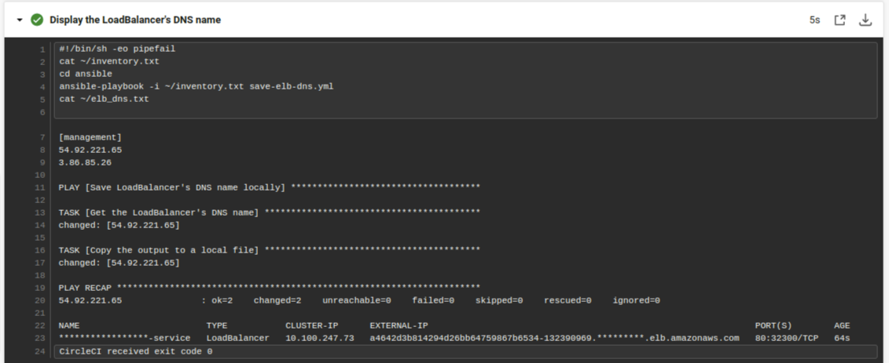

[](https://circleci.com/gh/hieugiddy/udacity-capstone)
# Cloud DevOps Engineer Capstone Project
This project represents the successful completion of the last final Capstone project and the Cloud DevOps Engineer Nanodegree at Udacity.

## Kubectl 
After the EKS-Cluster has been successfully configured using Ansible within the CI/CD Pipeline, I checked the deployment and service as follows:
```
[management]
54.92.221.65
3.86.85.26

PLAY [Save LoadBalancer's DNS name locally] ************************************

TASK [Get the LoadBalancer's DNS name] *****************************************
changed: [54.92.221.65]

TASK [Copy the output to a local file] *****************************************
changed: [54.92.221.65]

PLAY RECAP *********************************************************************
54.92.221.65               : ok=2    changed=2    unreachable=0    failed=0    skipped=0    rescued=0    ignored=0   

NAME                        TYPE           CLUSTER-IP      EXTERNAL-IP                                                              PORT(S)        AGE
*****************-service   LoadBalancer   10.100.247.73   a4642d3b814294d26bb64759867b6534-132390969.*********.elb.amazonaws.com   80:32300/TCP   64s

```


URL: http://a4642d3b814294d26bb64759867b6534-132390969.us-east-1.elb.amazonaws.com/


